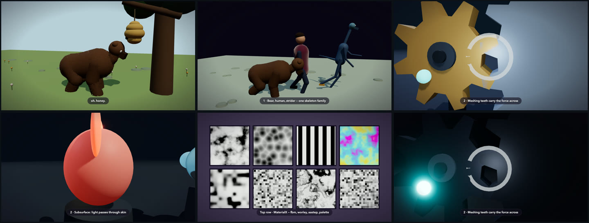

last updated: 2026-08-08

# mitate

A Claude Code skill that writes **an animated three.js scene as native HTML**.
There is no input format — whatever context your agent can already read is
enough: a prompt, a document, a codebase, a screenshot. Ask for one and you get
a single file that opens in any browser. Not a video: no player, no build step,
and the geometry is drawn live on every frame.

It is a pipeline an agent drives rather than a one-shot generator: it reshoots
parts, validates on three axes, and gets better over time.

**Every scene is a pure function of `t` — and `t` is a position, not a clock.**
It is an address you evaluate, not a cursor you advance: nothing ever asks what
time it is, only what the scene looks like at this address. Any `t`, in any
order, as many times as you like, always the same pixels.

That one property is what everything else is built on. The recorder shoots frames
out of order and in parallel. A check seeks away and back and compares bytes, so
a regression is detectable rather than arguable. A viewer scrubs backwards. And
duration is free: a frame at `t=18000` costs what a frame at `t=1` costs, and the
file is the same size either way, because the duration is a number in a table.

The whole surface tooling touches is a handful of `window.*` exports at the end
of every scene — [the window contract](#the-window-contract), below.

The tooling tries to abstract all this cleanly, but clean abstraction is nearly
impossible here — so treat it as a bootstrap to personalize. When the film you
want needs a primitive that doesn't exist yet, you build it on top — until
models can do all of this on their own.

[](https://mitate.microapp.me)

That sampler is a slice of what it makes today — the full corpus plays in the
browser at **[mitate.microapp.me](https://mitate.microapp.me)** — free and
MIT-licensed, and the site is just the films. The same scenes are tracked in
[`scenes/`](scenes/) (the film corpus — the plugin itself ships no films, and
that directory's README carries one section per film): open one from disk and
you get the real artifact, at full resolution and frame rate, rather than a
compressed recording of it. It's an early version — this is the current
output, not the ceiling.

*mitate* (見立て): to see one thing as another — the Japanese aesthetic of
representing one thing through another. Here, seeing any input as a scene.

**Why it is built this way, and why determinism comes first**, is
[`VISION.md`](VISION.md) — one page, and the thing to read before deciding this
project is just a video generator.

## Why do it this way, and what it costs

**What you gain.** The output is code, not pixels. An agent can reshoot one shot
without re-rendering the rest, and swap the whole look by changing one line. It
diffs and versions like source. It renders at any resolution from the same file,
because nothing is baked in. And determinism makes a regression byte-detectable:
the same `t` either matches the last run or it does not.

**What it can't do.** This is three.js with no image textures — flat color, node
math, GPU noise — so it is stylized by construction: it cannot be photoreal, and
no frame of footage ever appears in a film. It will not edit an existing video, a
screen recording, or a slide deck. The films are silent. Faces are not built yet.
The character films spend 4 to 5 seconds compiling shaders on a first visit on
capable hardware — slower devices, longer — and captions stop being legible below
roughly 700px of frame width.

**Where it is.** There's a balance in building in AI between "unfinished" and
"over-engineered", and this sits on the unfinished side (I think). Everything
here runs 12 to 37 seconds — kept short so the films open as live HTML on
ordinary devices. **Nothing caps duration**: a 60-second film has been built, and
a frame at t=18000 costs what a frame at t=1 costs, because the scene graph is
built once and every frame restates it rather than accumulating.
Characters are one skeleton family. I don't know yet whether this is useful — it
is fun to tinker with and see what it can do, and that is why it is public.

## The window contract

Everything the recorder, the smoke gate, and the showcase site can do, they do
through a few `window.*` exports at the end of every scene — never by reaching
into scene internals.

**It is tiered, which is the part usually missed.** `smoke.js` hard-asserts four
names — `seekTo`, `DURATION`, `stopPlayback`, `sceneReady` — and reads the rest
behind fallbacks, so a scene missing `BEATS` is degraded rather than broken.
`smoke.js`'s `CONTRACT` and `SOFT_CONTRACT` are the authority; this section is
the reader-facing view of them. This is the driver block from
[`gearbox.html`](scenes/gearbox.html) (search for
`window.seekTo`). The excerpt is abridged and may drift out of sync as scenes
evolve — the scene file is the source of truth:

```js
// the driver (abridged)
window.DURATION = TOTAL;            // derived from BEATS, cannot disagree
window.BEATS    = BEATS;            // tools label frames by beat
window.FRAME    = FRAME;            // the declared aspect + px
window.FLASHES  = FLASHES;          // flash midpoints, absolute seconds
window.CAPFADE  = CONFIG.capFade;   // caption fade, for the reading-speed lint
window.SHOTS    = SHOTS.map(/* cut-entry windows */);

window.seekTo = function (t) {      // the f in f(t)
  uTime.value = t;
  const state = { t };              // the driver builds it; the kernel reads it
  setCamera(state); animate(t); setOverlay(t);
  pipeline.render();
};
window.stopPlayback = function () { playing = false; };
// …and window.sceneReady = true, once every shader is warm
```

The names are permanent — every tool depends on them. The list grows when a
tool needs an export rather than a peek: `FLASHES` and `SHOTS` joined the day
a check needed them. The showcase site is itself a consumer — its hero drives
gearbox through `seekTo`, live.

## Install

```
/plugin marketplace add fblissjr/mitate
/plugin install mitate@mitate
```

Then ask for one, in whatever words you'd normally use: *"animate how our
approval process flows"*, *"make a boss-intro cutscene for this creature"*,
*"turn docs/data-flywheel.md into an explainer"*, *"make this joke an animated
meme"*.

The corpus films run 12 to 37 seconds; a 60-second one has been built. A film
lasts exactly as long as the beats written for it, and the HTML file is the same
size either way, because the duration is a number in a table. What grows with
length is recording time and the number of beats to author and review — not the
artifact, the memory, or the cost of a frame.

**WebGPU is not required** — scenes use three.js `WebGPURenderer`, which falls
back to WebGL2 transparently, so any WebGL2 browser plays one.

**The toolchain is local, and how much of it you need depends on the backend.**
The Canvas2D template is born self-contained and needs nothing at all. A three.js
scene needs `bun` to embed three into the file — skipping that is recoverable,
since every `build.js` command embeds automatically (a direct `shoot.js` run is
the one path that does not). Rendering to MP4 or
AVIF, and running the review instruments, needs `bun`, ffmpeg and a Chromium.
See [`plugin/README.md`](plugin/README.md#installation).

That local dependency is worth knowing if you use Claude somewhere other than
Claude Code: Cowork and cloud sessions load the skills enabled on your claude.ai
account rather than a locally installed plugin, and they are a different
environment from the one these commands assume. **Nobody has run mitate there,
so treat it as untested rather than supported.**

## Layout

| Path | What |
|---|---|
| [`plugin/`](plugin/) | The skill itself — manifest, `skills/mitate/` with SKILL.md, references, templates. No films ship in it. See [`plugin/README.md`](plugin/README.md) |
| [`site/`](site/) | The static showcase site behind [mitate.microapp.me](https://mitate.microapp.me) — one hand-authored page, no framework |
| [`docs/`](docs/) | [`plan.md`](docs/plan.md) (founding plan, architecture, phase gates), [`physics-bake-proposal.md`](docs/physics-bake-proposal.md), and [`predecessor-record.md`](docs/predecessor-record.md) (the frozen predecessor's measured findings, inherited) |
| [`scenes/`](scenes/) | The tracked film corpus — full repo members (CI-smoked, parity-checked, on the site), not shipped in the plugin |
| [`scripts/`](scripts/) | `stage-films.sh` — copies `scenes/` into `site/films/` at build time |

Each scene HTML file is tracked once, in `scenes/`, and staged into
`site/films/` at deploy. Edit them where they live.

## Status

Phases 0–2 are complete and gated: the node-stack templates, recorder, and
instruments on both backends; the material packs and style bibles; the character
scaffold, demonstrated by `menagerie` and delivered by `bear-and-bees`. A chart
tier sits below the films for isolating shader primitives. Phase 4, the physics
bake, is next by phase priority; the 2026-07 restructure migration completed and
its plan retired itself, so the live queue is [`docs/README.md`](docs/README.md)'s
work-next row — films from the test-case portfolio first.
Architecture and phase gates in
[`docs/plan.md`](docs/plan.md); the current ranked work — instruments, doc
routing, and what is deliberately deferred with the trigger that revives it — in
[`docs/working-plan.md`](docs/working-plan.md); version history in
[`CHANGELOG.md`](CHANGELOG.md).

## License

MIT — see [LICENSE](LICENSE). Third-party notices (three.js, embedded in every
scene) are in [THIRD_PARTY_LICENSES.md](THIRD_PARTY_LICENSES.md).
