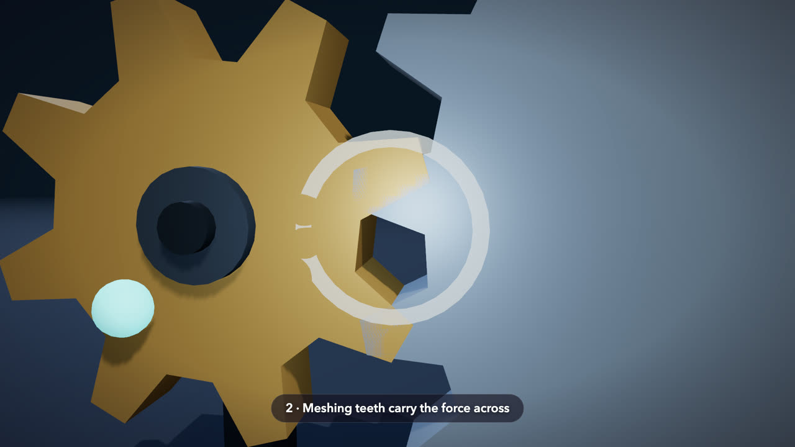
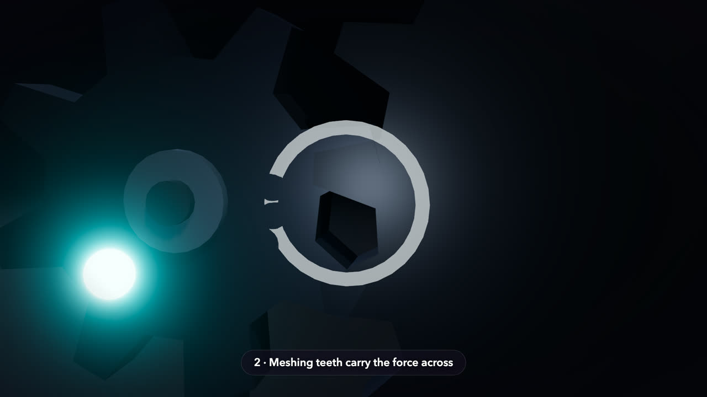
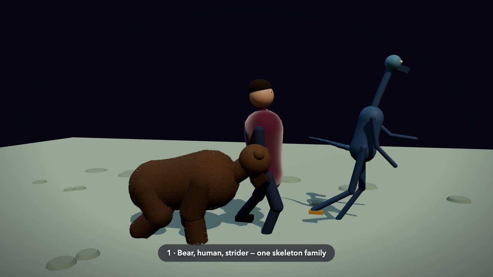
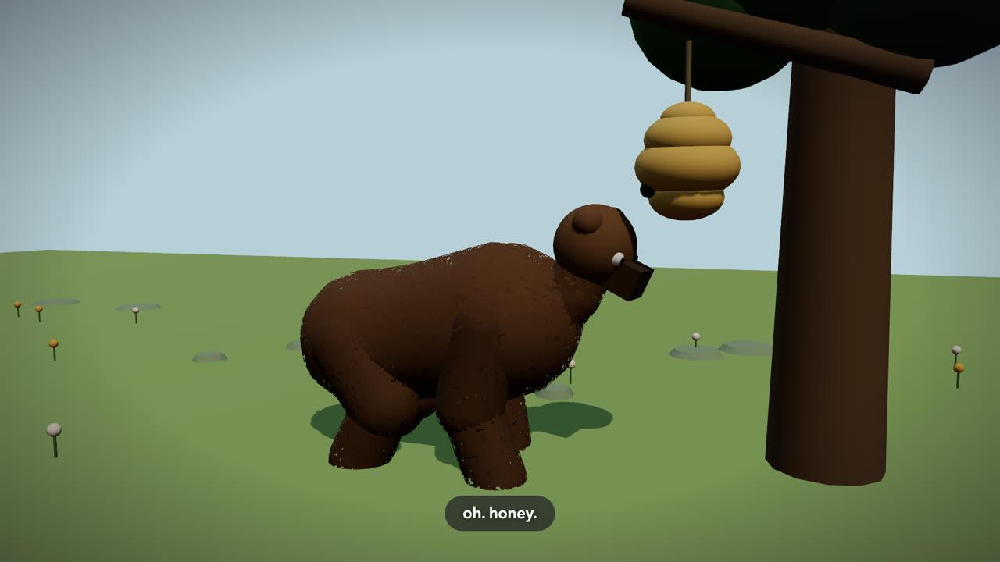
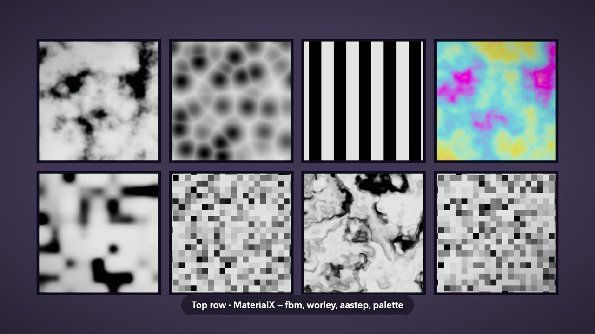
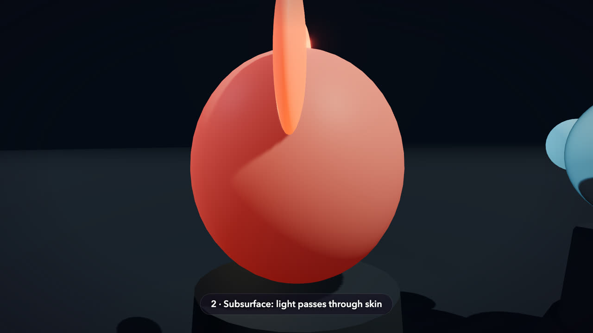

# mitate examples

last updated: 2026-07-24

Each example is a complete, self-contained film: open the `.html` straight
from disk and it plays. **WebGPU is not required** — the embedded
`WebGPURenderer` falls back to WebGL2 transparently, so any WebGL2-capable
browser plays these; with a WebGPU adapter present it is used automatically.
These are the skill's teaching baselines — SKILL.md and the references point
at them — and every one passed the full instrument suite (smoke on both
backends, sheets, motion, independent review).

Poster frames live in [`site/posters/`](../../../../site/posters/) at the repo
root, NOT here: the plugin subtree ships to every installed user and is cached
per version, so it carries only what the skill itself needs.

> **The stills below are one frame each, rendered from the scene.** They are not
> recordings and there is no compressed loop to watch — GitHub cannot run a
> scene, so a frame is the honest thing to show here. The `.html` next to each
> one is the artifact: open it and the scene runs.

## gearbox

[`gearbox.html`](gearbox.html) — the regression film against frozen
explainer-video: the same scene body on both stacks, judged side-by-side.
Five beats, 16.5s, seamless loop by construction. Showcases the baseline
pipeline: beats, the shot solver, the node post chain.

The same file carries the committed style-bible control pair: switch
`const STYLE = BIBLES.workshop` to `BIBLES.neon` — one line — and the same
beats render as a dark stage where the light is the subject:

## menagerie

[`menagerie.html`](menagerie.html) — the Phase 2 character-scaffold gate
demonstration: a furred bear, a fabric-shirted human, and a text-invented
three-eyed strider — three proportion vectors through ONE `buildCharacter`,
walking in on their own gaits (lateral-sequence quadruped, biped,
long-stride biped), stopping, looking at camera. Squint-distinct
silhouettes, strip-checked planted feet, byte-deterministic on both
backends. Showcases the character scaffold, the fur and fabric packs, and
gait.

## bear-and-bees

[`bear-and-bees.html`](bear-and-bees.html) — the Phase 2 film deliverable,
a 21.3s comedy short carrying the comedic-timing half of the gate: a furred
bear ambles in, nose-boops a hanging hive, and the film HOLDS (2.6s of
near-stillness, one scout bee at the bear's eyeline, a double blink to
camera) before 1.1s of everything at once. Locked silent-comedy camera; the
gag reads with zero captions (nocap pass). Every contact is probe-measured
in all three axes: the boop solves to a surface graze (normalized 1.02),
and the flee passes UNDER the hive with measured clearance. Showcases
pause-then-fast timing, probe-solved staging, and the character register.

## noise-chart

[`noise-chart.html`](noise-chart.html) — the first chart-tier scene:
charts isolate primitives the way films integrate them (one primitive per
cell, judged before anything downstream uses it). Eight cells: the top row
is the MaterialX baseline (fbm, worley, aastep, palette-mapped fbm); the
bottom row is hash-lattice primitives (value noise, re-hashed cells,
domain-warped fbm) plus the classic sin-hash as a deliberate drift
CONTROL — cells 6 and 8 are byte-identical constructions except for the
hash function. Verified 20/20 smoke-green across 15 WebGPU-Metal and 5
WebGL2-fallback runs, control included. Showcases the primitive-isolation
tier and the determinism instruments doing their job.

## materials

[`materials.html`](materials.html) — the pack showcase: one film, three
beats, three surfaces — TSL-native cel banding, subsurface scattering
through thin ears, transmissive glass with dispersion over an emissive core
(the overlapping-transparency ordering case). Recipes and measured gotchas:
`../references/materials.md`.

